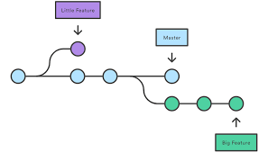

# Básicos de git, github e workflow v0.1 #

Esse arquivo foi utilizado em um workshop sobre git, github e workflow dado a Fronteira Tec em 09/09/2020.
O conteúdo que foi colocado dentro desse workshop foi decidido poucas horas antes do mesmo, pois houve uma mudança de última hora sobre quem iria apresenta-lo.

## Sumário ##

## 1. Inciando com git ##

### 1.0. Installando o git ###

Ubuntu:

```bash
sudo apt install git
```

Other OS:

<https://git-scm.com/book/en/v2/Getting-Started-Installing-Git>

### 1.1. O que é o Git ###

"Git é uma ferramenta de controle de versão distribuido."

### 1.2. Configurações ###

Caso não tenha configurado seu git aqui estão os comandos.

#### 1.2.1. Necessários #####

Definir usuário

"Para todos projetos":

```git
git config --global user.name "<seuNomeDeUsuárioDoGithub>"
```

"Para um projeto específico" (Dentro do diretório do proejeto):

```git
git config user.name "<seuNomeDeUsuárioDoGithub>"
```

Definir email

"Para todos projetos":

```git
git config --global user.email "<seuEmailDoGithub>"
```

"Para um projeto específico" (Dentro do diretório do proejeto):

```git
git config user.email "<seuEmailDoGithub>"
```

#### 1.3.1. Opcionais #####

Listar Configurações

```git
git config --list
```

Definir editor padrão

"Para todos projetos":

```git
git config --global core.editor vim
```

"Para um projeto específico" (Dentro do diretório do proejeto):

```git
git config core.editor vim
```

### 1.3. Clonando um repositório ###

Vamos clonar o repositório onde esse arquivo se encontra atráves do seguinte comando:

```git
git clone git@github.com:FronteiraTec/workshop-git.git
```

ou

```git
git clone https://github.com/FronteiraTec/workshop-git.git
```

Obs. Para entrar no repositória pelo terminal ou cmd:

```bash
cd workshop-git
```

### 1.4. Branches ###

#### 1.4.1. O que é um branch ####

O branch é como uma ramificação de uma versão.


#### 1.4.2. Como ver os branches existentes ####

```git
git branch -a
```

#### 1.4.3. Como trocar de branch ####

```git
git checkout <nomeDoBranch>
```

#### 1.4.4. Como criar um novo branch local e mudar para ele ####

```git
git checkout -b <nomeDoNovoBranchLocal>
```

#### 1.4.5. Como enviar o branch local para a remoto ####

```git
git push --set-upstream origin <nomeDoNovoBranchLocal>
```

#### 1.4.6. Padronização de nomenclatura nos branches da Fronteira Tec ####

Esse tópico está mais relacionado com o workflow, mas é tão importante que aparece duas vezes.

- Todo nome de branch deve ser em inglês.
- Se possuir mais de uma palavra usar camelCase. exemploSimplesDoQueECamelCase.

```text
feature/<featureName>
doc/<docName>
fix/<fixName>
merge/<mergeName>
```

Obs. Geralmente não se faz necessário criar uma branch nova para merge, mas caso seja usar o padrão.

Obs. Caso exista algum tópico que não esteja aqui basta sugerir via pull request.

### 1.5. Adicionando e enviando mudanças para o remoto, verificando status e solicitando atualização do repositório local ####

Add: Adicionar o arquivo é como colocar numa "fila de espera" onde você está preparando mudanças para serem enviadas.
Commit: Dar um nome para essa "fila de espera".
Push: Enviar essa "fila de espera" para o remoto.

#### 1.5.1. Adicionando mudanças (add) ####

Para adicionar um único arquivo:

```git
git add <caminhoDentroDoDiretórioAtéOArquivo>/<nomeDoArquivo.extensão>
```

Para adicionar todos arquivos (estando na raiz do repositório)

```git
git add .
```

#### 1.5.2. Comentando mudanças (commit) ####

Os commits possuem um tag que serve para identifica-los, como por exemplo nesse repositório temos o commit c73428798b7904036eff63ec10b5f86a4ea70583, mas para informar de forma "amigável" usamos a flag -m para adicionar uma mensagem ao mesmo, como no exemplo citado a mensagem é: "arquivo de exemplo adicionado"

Commit com mensagem (O recomendado é a mensagem possuir Caracteres <= 50 e devemos começar com letra maiuscula e não deve terminar com ponto final):

```git
git commit -m "<BreveDescriçãoSobreAsMudançasMenorQue50Caracteres>"
```

#### 1.5.3. Enviando mudanças (push) ####

Após ter adicionado os arquivos modificados (criados, deletados, movidos, renomeados, ...), deve-se enviar essas mudanças para o remoto.

Enviando Alterações

```git
git push
```

#### 1.5.4. Verificando Status (status) ####

Para verificar o status do seu workspace, é necessário usar o comando git status

Commit com mensagem (O recomendado é a mensagem possuir Caracteres <= 50 e devemos começar com letra maiuscula e não deve terminar com ponto final):

```git
git status
```

#### 1.5.5. Verificando modificações no remoto (fetch) ####

Para verificar se ocorreram mudanças no remoto basta usar o fetch:

```git
git fetch
```

#### 1.5.6. Solicitando atualização dos arquivos do repositório local (pull) ####

Para atualizar seu repositório local basta utilizar o comando pull.

```git
git pull
```

Caso não exista conflito, mudanças "não efetivadas" ou quaisquer problema do genêro, o repositório local será atualizado com os arquivos do remoto.

## 2. Github ##

Lorem Ipsum

## 3. Workflow v0.1 ##

**Esse workflow é temporário visando simplificar em primeiro momento sem usar forks, já que alguns membros ainda nem tiveram um contato anterior significante com git e github.**

### 3.1. Branches Fixos ###

As branches padrões do workflow são:

1. master
2. dev

### 3.2. Branches de desenvolvimento ####

Quando algo for ser implementado criar uma branch nova com o "prefixo" adequado como nos exemplos abaixo:

```text
feature/<featureName>
doc/<docName>
fix/<fixName>
merge/<mergeName>
```

1. Todo nome de branch deve ser em inglês.
2. Se possuir mais de uma palavra usar camelCase. exemploSimplesDoQueECamelCase.

Obs. Geralmente não se faz necessário criar uma branch nova para merge, mas caso seja usar o padrão.

Obs. Caso exista algum tópico que não esteja aqui basta sugerir via pull request.

### 3.3. Pull Requests ###

Todo pull request originado de um branch de desenvolvimento deve ser destinado ao dev.

Após Code Review por uma pessoa que não seja quem fez o Pull Request, se estiver tudo correto e nos padrões de codificação e de workflow, a pessoa que fez o code review pode aceitar o pull request.

Após um branch de desenvolvimento ter sido aceito em dev, deve-se abrir um Pull Request para passar de dev para master.

```text
Exemplo:

<feature/signIn> -> <dev>
<dev> -> <master>
```

## 4. Extras ##

### 4.1. .gitignore ###

O gitignore é um arquivo utilizado para o git ignorar arquivos que não são necessário para o projeto.
Exemplo: Arquivos de compilação.

